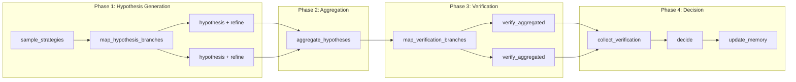

# LangGraph Multi-Branch Workflow Pattern

병렬 브랜치 실행 및 집계를 위한 LangGraph StateGraph 패턴. GCRI의 핵심 워크플로우 구조.

## 2-Phase 아키텍처 개요

GCRI는 **Hypothesis Generation → Aggregation → Verification** 2단계 구조를 사용:



## 핵심 구조

```python
from langgraph.constants import START, END
from langgraph.graph import StateGraph
from langgraph.types import Send

# 1. 메인 그래프와 브랜치 서브그래프 분리
graph = StateGraph(TaskState)

# 2. Phase 1: Hypothesis 생성 서브그래프
hypothesis_branch = StateGraph(BranchState)
hypothesis_branch.add_node('hypothesis', hypothesis_func)
hypothesis_branch.add_node('reasoning_and_refine', refine_func)
hypothesis_branch.add_edge(START, 'hypothesis')
hypothesis_branch.add_edge('hypothesis', 'reasoning_and_refine')
hypothesis_branch.add_edge('reasoning_and_refine', END)
hypothesis_workflow = hypothesis_branch.compile()

# 3. Phase 3: Verification 서브그래프
verification_branch = StateGraph(VerificationBranchState)
verification_branch.add_node('verify', verify_func)
verification_branch.add_edge(START, 'verify')
verification_branch.add_edge('verify', END)
verification_workflow = verification_branch.compile()

# 4. 메인 그래프 구성
graph.add_node('sample_strategies', sample_strategies_func)
graph.add_node('hypothesis_executor', hypothesis_workflow)
graph.add_node('aggregate_hypotheses', aggregate_hypotheses_func)
graph.add_node('verification_executor', verification_workflow)
graph.add_node('collect_verification', collect_verification_func)
graph.add_node('decide', decide_func)
graph.add_node('update_memory', update_memory_func)

# 5. 엣지 연결
graph.add_edge(START, 'sample_strategies')
graph.add_conditional_edges('sample_strategies', map_hypothesis_branches, ['hypothesis_executor'])
graph.add_edge('hypothesis_executor', 'aggregate_hypotheses')
graph.add_conditional_edges('aggregate_hypotheses', map_verification_branches, ['verification_executor'])
graph.add_edge('verification_executor', 'collect_verification')
graph.add_edge('collect_verification', 'decide')
graph.add_edge('decide', 'update_memory')
graph.add_edge('update_memory', END)
```

## State 정의 패턴

```python
from pydantic import BaseModel, Field
from typing import List, Optional, Annotated, Dict
import operator

# Phase 1 결과
class RawHypothesis(BaseModel):
    index: int
    strategy_name: str
    strategy_description: str
    hypothesis: str
    reasoning: str
    container_id: str

# Phase 2 결과 (Aggregation 후)
class AggregatedBranch(BaseModel):
    index: int
    combined_hypothesis: str
    source_indices: List[int]
    merge_reasoning: str

class AggregationResult(BaseModel):
    branches: List[AggregatedBranch]
    discarded_indices: List[int] = Field(default_factory=list)
    aggregation_summary: str

# 브랜치 상태
class BranchState(BaseModel):
    index: int
    strategy: Strategy
    container_id: str
    hypothesis: Optional[str] = None
    reasoning: Optional[str] = None

class VerificationBranchState(BaseModel):
    index: int
    aggregated_branch: AggregatedBranch
    container_id: str

# 메인 상태
class TaskState(BaseModel):
    task: str
    strategies: List[Strategy] = Field(default_factory=list)
    # Annotated로 리스트 병합 연산자 지정
    raw_hypotheses: Annotated[List[RawHypothesis], operator.add] = Field(default_factory=list)
    aggregated_branches: List[AggregatedBranch] = Field(default_factory=list)
    verification_container_map: Dict[int, str] = Field(default_factory=dict)
    results: Annotated[List[HypothesisResult], operator.add] = Field(default_factory=list)
    final_decision: Optional[bool] = None
```

## 병렬 브랜치 매핑

### Phase 1: Hypothesis 브랜치 생성

```python
def map_hypothesis_branches(state: TaskState):
    """Send 객체 리스트를 반환하여 병렬 hypothesis 브랜치 실행"""
    sends = []
    for index, strategy in enumerate(state.strategies):
        container_id = sandbox.setup_branch(state.count, index)
        sends.append(Send('hypothesis_executor', {
            'index': index,
            'strategy': strategy.model_dump(),
            'container_id': container_id,
            'task': state.task
        }))
    return sends
```

### Phase 3: Verification 브랜치 생성

```python
def map_verification_branches(state: TaskState):
    """Aggregation 결과로부터 verification 브랜치 생성"""
    sends = []
    for branch in state.aggregated_branches:
        container_id = state.verification_container_map[branch.index]
        sends.append(Send('verification_executor', {
            'index': branch.index,
            'aggregated_branch': branch.model_dump(),
            'container_id': container_id,
            'task': state.task
        }))
    return sends
```

## Aggregation 패턴

```python
def aggregate_hypotheses(state: TaskState):
    """RawHypothesis들을 AggregatedBranch로 병합"""
    # 1. HypothesisAggregator로 병합 수행
    aggregation_result = aggregator.aggregate(state)
    
    # 2. 검증용 컨테이너 매핑 생성
    source_containers = {hyp.index: hyp.container_id for hyp in state.raw_hypotheses}
    verification_containers = sandbox.setup_verification_branches(
        state.count, aggregation_result.branches, source_containers
    )
    
    return {
        'aggregated_branches': aggregation_result.branches,
        'verification_container_map': verification_containers
    }
```

## 컨테이너 재사용 전략

| 시나리오 | 처리 방식 |
|----------|-----------|
| 단일 소스 브랜치 | 기존 컨테이너 재사용 |
| 다중 소스 병합 | 첫 번째 소스 컨테이너 사용 (또는 새 컨테이너 생성) |

## 사용 시점

- 동일 작업을 여러 전략으로 병렬 시도할 때
- 가설을 집계/병합하여 중복을 제거할 때
- 집계된 가설만 검증하여 리소스를 절약할 때
- 메인 코디네이터가 병렬 워커를 2-phase로 제어할 때

## 참고 파일

- `gcri/graphs/gcri_unit.py` - GCRI 클래스의 워크플로우 구성
- `gcri/graphs/states.py` - TaskState, BranchState, VerificationBranchState 정의
- `gcri/graphs/schemas.py` - RawHypothesis, AggregatedBranch, AggregationResult 정의
- `gcri/graphs/generators.py` - BranchesGeneratorProtocol 및 구현체
- `gcri/graphs/aggregator.py` - HypothesisAggregator 클래스
