# GCRI
**Generalized Counterexample-Reinforced Intelligence**

<p align="center">
  
</p>

## Overview

GCRI (Generative Code Reasoning Intelligence) Single Unit is a **Hierarchical Multi-Agent System** where central coordination and field execution are separated. Rather than simply generating code, strategy formulation-execution-verification-evaluation stages are performed by different specialized agents, and this process occurs in isolated sandbox environments.

This is not just an LLM wrapper—it's an agent-centric architecture where multiple teams compete, critique, and converge to produce verified solutions.

---

## GCRI as a Thinking Unit

### Single Unit = Intelligent Resource Controller

A single GCRI loop functions as **one unified thinking unit** that can replace traditional LLM calls. Unlike simple prompt-response patterns, each GCRI unit:

- **Controls Resources:** Manages its own workspace, file system, and execution environment
- **Self-Verifies:** Internal red team challenges every solution before returning results
- **Learns from Failures:** Builds constraints that prevent repeated mistakes
- **Returns Verified Output:** Only outputs that survive internal criticism are released

Think of it as a **"super-LLM"** where a single function call triggers an entire competitive ecosystem of agents working toward the same goal.

### Composability: GCRI Units as Building Blocks

Because GCRI is a complete graph with clear input/output contracts, it can be **composed** into larger systems:

```mermaid
%%{init: {'theme':'base', 'themeVariables': { 'primaryColor':'#e1f5ff','primaryTextColor':'#1a1a1a','primaryBorderColor':'#0066cc','lineColor':'#0066cc','secondaryColor':'#fff3cd','tertiaryColor':'#f0f0f0'}}}%%
graph TB
    Goal["🎯 Complex Goal<br/><i>Multi-step problem</i>"] --> MP["📋 Meta-Planner<br/><i>Task Orchestrator</i>"]

    MP -->|"📝 Task 1: Design"| U1["🧠 GCRI Unit 1<br/><i>3 competing teams</i>"]
    U1 -->|"✅ Verified Design"| MP

    MP -->|"💻 Task 2: Implement"| U2["🧠 GCRI Unit 2<br/><i>3 competing teams</i>"]
    U2 -->|"✅ Verified Code"| MP

    MP -->|"🧪 Task 3: Test"| U3["🧠 GCRI Unit 3<br/><i>3 competing teams</i>"]
    U3 -->|"✅ Verified Tests"| MP

    MP -->|"🚀 Task 4: Deploy"| U4["🧠 GCRI Unit 4<br/><i>3 competing teams</i>"]
    U4 -->|"✅ Verified Deployment"| MP

    MP --> Final["🎉 Final Solution<br/><i>All steps verified</i>"]

    style Goal fill:#f8f9fa,stroke:#6c757d,stroke-width:3px,color:#000
    style MP fill:#fff3cd,stroke:#ffc107,stroke-width:3px,color:#000
    style U1 fill:#e1f5ff,stroke:#0066cc,stroke-width:2px,color:#000
    style U2 fill:#e1f5ff,stroke:#0066cc,stroke-width:2px,color:#000
    style U3 fill:#e1f5ff,stroke:#0066cc,stroke-width:2px,color:#000
    style U4 fill:#e1f5ff,stroke:#0066cc,stroke-width:2px,color:#000
    style Final fill:#d4edda,stroke:#28a745,stroke-width:3px,color:#000

    classDef gcriUnit fill:#e1f5ff,stroke:#0066cc,stroke-width:2px
    class U1,U2,U3,U4 gcriUnit
```



The **Meta-Planner** (`gcri plan`) decomposes complex goals into sequential tasks and delegates each to a fresh GCRI unit. Each unit:
1. Receives context from previous units
2. Executes its specialized task with full agent competition
3. Returns verified results to the planner
4. Passes accumulated knowledge to the next unit

This enables **modular reasoning** where each step is internally verified before proceeding.

---

## Architecture: The Coordinators vs. The Workers

### The Coordinators (Central Command - Main Graph)

The management layer that sets system direction, audits results, and makes final decisions.

| Agent | Role | Key Responsibilities | Input/Output |
|:---|:---|:---|:---|
| **Strategy Generator**<br>(Strategy Planner) | **Tactician** | • **Multi-angle Approach:** Analyzes user requirements to establish N different solution strategies, not a single solution.<br>• **Diversity Assurance:** Sets different initial directions so that all branches don't write identical code. | • **Input:** Task, Memory (Constraints)<br>• **Output:** `Strategies` (List of strings) |
| **Decision Maker**<br>(Final Authority) | **Judge** | • **Gatekeeping:** Coldly evaluates the validity of results from each execution branch.<br>• **Winner Selection:** If the task is accomplished, identifies the 'winning branch' that wrote the most perfect code.<br>• **Deployment Approval:** Sends approval signal for the system to merge (commit) sandbox results to the original project. | • **Input:** Aggregated Results, File Contexts<br>• **Output:** `Decision` (Bool), `best_branch_index` |
| **Memory Manager**<br>(Memory Keeper) | **Analyst** | • **Failure Analysis:** Analyzes errors and logical flaws from failed loops.<br>• **Constraint Generation:** Converts "what should never be done next time" into `ActiveConstraints` to continuously update agent intelligence. | • **Input:** Global Feedback<br>• **Output:** `ActiveConstraints` (Rules) |

### The Workers (Field Execution Team - Branch Subgraph)

The practitioner layer that performs actual coding and verification within isolated sandboxes created per branch.

| Agent | Role | Key Responsibilities | Input/Output |
|:---|:---|:---|:---|
| **Hypothesis Generator**<br>(Code Generator) | **Coder** | • **Execution:** Implements assigned strategy into actual working code.<br>• **File Manipulation:** Directly accesses sandbox filesystem to create (`write_file`) or modify files. | • **Input:** Task, Strategy<br>• **Output:** `Hypothesis` (Code Artifacts) |
| **Reasoning Agent**<br>(Refiner) | **Reviewer** | • **Self-Critique:** Doesn't immediately execute coder's hypothesis, but first reviews for logical leaps or missing requirements.<br>• **Refinement:** Reinforces logic and refines (concretizes) hypothesis. | • **Input:** Hypothesis<br>• **Output:** `Reasoning` (Refined Logic) |
| **Verification Agent**<br>(Verifier) | **Red Team** | • **Vulnerability Search:** Finds logical flaws or execution errors in written code.<br>• **Counter-Example Generation:** Presents specific 'counter-examples' that can break the code to test solution robustness.<br>• **Survival Judgment:** If code cannot withstand this counter-example, that branch fails. | • **Input:** Refined Hypothesis<br>• **Output:** `Verification` (Counter-Example) |

---

## Collaboration Flow

```mermaid
%%{init: {'theme':'base', 'themeVariables': { 'primaryColor':'#e8f4f8','primaryTextColor':'#1a1a1a','primaryBorderColor':'#2196F3','lineColor':'#666','secondaryColor':'#fff8e1','tertiaryColor':'#f3e5f5'}}}%%
graph TB
    User["👤 User Task<br/><i>Problem to solve</i>"] --> SG["🎯 Strategy Generator<br/><i>Coordinator</i>"]

    SG -->|"📍 Strategy A"| B1["📦 Branch A<br/><i>Isolated Workspace</i>"]
    SG -->|"📍 Strategy B"| B2["📦 Branch B<br/><i>Isolated Workspace</i>"]
    SG -->|"📍 Strategy C"| B3["📦 Branch C<br/><i>Isolated Workspace</i>"]

    subgraph Team_A["🔵 Team A Pipeline"]
        B1 --> H1["💡 Hypothesis<br/><i>Coder</i>"]
        H1 --> R1["🔍 Reasoning<br/><i>Reviewer</i>"]
        R1 --> V1["⚔️ Verification<br/><i>Red Team</i>"]
    end

    subgraph Team_B["🟢 Team B Pipeline"]
        B2 --> H2["💡 Hypothesis<br/><i>Coder</i>"]
        H2 --> R2["🔍 Reasoning<br/><i>Reviewer</i>"]
        R2 --> V2["⚔️ Verification<br/><i>Red Team</i>"]
    end

    subgraph Team_C["🟡 Team C Pipeline"]
        B3 --> H3["💡 Hypothesis<br/><i>Coder</i>"]
        H3 --> R3["🔍 Reasoning<br/><i>Reviewer</i>"]
        R3 --> V3["⚔️ Verification<br/><i>Red Team</i>"]
    end

    V1 --> DM["⚖️ Decision Maker<br/><i>Judge</i>"]
    V2 --> DM
    V3 --> DM

    DM -->|"🏆 Winner"| Deploy["🚀 Deploy<br/><i>Copy to Project Root</i>"]
    DM -->|"❌ All Failed"| MM["🧠 Memory Manager<br/><i>Learn from Failure</i>"]
    MM -.->|"📝 New Constraints"| SG

    style User fill:#f8f9fa,stroke:#6c757d,stroke-width:3px,color:#000
    style SG fill:#fff3cd,stroke:#ffc107,stroke-width:3px,color:#000
    style DM fill:#e8eaf6,stroke:#5c6bc0,stroke-width:3px,color:#000
    style MM fill:#fce4ec,stroke:#ec407a,stroke-width:2px,color:#000
    style Deploy fill:#d4edda,stroke:#28a745,stroke-width:3px,color:#000

    style B1 fill:#e3f2fd,stroke:#2196F3,stroke-width:2px,color:#000
    style B2 fill:#e8f5e9,stroke:#4caf50,stroke-width:2px,color:#000
    style B3 fill:#fff9c4,stroke:#ffeb3b,stroke-width:2px,color:#000

    style H1 fill:#e1f5fe,stroke:#0288d1,stroke-width:2px,color:#000
    style R1 fill:#e1f5fe,stroke:#0288d1,stroke-width:2px,color:#000
    style V1 fill:#e1f5fe,stroke:#0288d1,stroke-width:2px,color:#000

    style H2 fill:#f1f8e9,stroke:#689f38,stroke-width:2px,color:#000
    style R2 fill:#f1f8e9,stroke:#689f38,stroke-width:2px,color:#000
    style V2 fill:#f1f8e9,stroke:#689f38,stroke-width:2px,color:#000

    style H3 fill:#fffde7,stroke:#fbc02d,stroke-width:2px,color:#000
    style R3 fill:#fffde7,stroke:#fbc02d,stroke-width:2px,color:#000
    style V3 fill:#fffde7,stroke:#fbc02d,stroke-width:2px,color:#000

    style Team_A fill:#e3f2fd,stroke:#1976d2,stroke-width:2px,stroke-dasharray: 5 5
    style Team_B fill:#e8f5e9,stroke:#388e3c,stroke-width:2px,stroke-dasharray: 5 5
    style Team_C fill:#fff9c4,stroke:#f57f17,stroke-width:2px,stroke-dasharray: 5 5
```



### Process Steps

1. **Command:** `Strategy Generator` analyzes the problem and issues 3 infiltration routes (strategies): A, B, C.
2. **Isolation:** System builds 3 mutually invisible sandboxes (workspaces) for teams A, B, C. (Smart Copy & Link)
3. **Execution:**
   - Each team's `Hypothesis Generator` writes code.
   - `Reasoning Agent` refines it.
   - `Verification Agent` attacks and attempts to break it.
4. **Report:** Survival status and results from each team are reported to `Decision Maker`.
5. **Verdict & Merge:** If `Decision Maker` judges Team B's results as best, the system reflects only Team B's sandbox contents to the original server.

---

## Core Architecture Values

### 🎯 Clear R&R Separation
Planners (Strategy), executors (Hypothesis), verifiers (Verification), and evaluators (Decision) are separated, minimizing bias and hallucination.

### 🏆 Competitive Evolution
Multiple agent teams compete in parallel to find optimal solutions.

### 🔒 Safe Execution
All execution occurs in environments isolated from the main system, with only verified results exported.

### 🧠 Continuous Learning
Failed attempts are converted into constraints, making the system smarter with each iteration.

---

## Quick Start

### Prerequisites
- Python 3.11+ recommended
- Install dependencies with pip (requirements.txt included)
- Set up environment variables in .env file (e.g., OPENAI_API_KEY)

### Installation

```bash
# Clone repository
git clone https://github.com/yourusername/GCRI.git
cd GCRI

# Create virtual environment
python -m venv .venv
source .venv/bin/activate   # macOS / Linux
# .\.venv\Scripts\activate  # Windows

# Install dependencies
pip install -r requirements.txt
```

### Basic Usage

**Single Task Mode** - Execute one task with multiple competing strategies:

```bash
gcri
```

Enter your task at the prompt. GCRI will spawn multiple agent teams that compete to solve it.

**Planner Mode** - Break down complex goals into sequential tasks:

```bash
gcri plan
```

The meta-planner will decompose your goal into subtasks and execute them systematically.

### Programmatic Usage

```python
from gcri.config import scope
from gcri.graphs.gcri_unit import GCRI

config = scope()  # returns config object
unit = GCRI(config)
result = unit('Write a Python script to analyze CSV files')
print(result['final_output'])
```

---

## Configuration Presets

GCRI includes pre-configured presets for different use cases and model providers:

### Available Presets
- **Balanced:** General-purpose configuration with good speed/quality tradeoff
- **Coding Specialist:** Optimized for code generation tasks
- **Deep Research:** Maximum thoroughness for complex problems
- **Lightweight:** Fast execution with minimal resource usage

### Supported Providers
- **GPT-5 series** (`gpt_5_*.json`)
- **Claude series** (`claude_*.json`)
- **Gemini series** (`gemini_*.json`)
- **Mixed providers** (`mixed_*.json`)
- **Local models** (`local_*.json`)

Load a preset:
```python
from gcri.config import scope

# Load GPT-5 balanced preset
config = scope(preset='presets/gpt_5_balanced.json')
unit = GCRI(config)
```

---

## Project Structure

```
GCRI/
├── assets/                 # Project assets (logos, images)
├── gcri/
│   ├── config.py          # Configuration management
│   ├── entry.py           # CLI entry point
│   ├── graphs/
│   │   ├── gcri_unit.py   # Core GCRI workflow
│   │   ├── planner.py     # Meta-planner for multi-task
│   │   ├── schemas.py     # Pydantic data models
│   │   └── states.py      # Workflow state definitions
│   ├── templates/         # Prompt templates
│   │   ├── strategy_generator.txt
│   │   ├── hypothesis.txt
│   │   ├── reasoning.txt
│   │   ├── verification.txt
│   │   ├── decision.txt
│   │   └── memory.txt
│   └── tools/
│       └── cli.py         # Local execution tools
├── presets/               # Pre-configured model setups
└── README.md
```

---

## Advanced Features

### Workspace Isolation
Each branch executes in its own isolated workspace directory:
- Pattern: `logs/{timestamp}/workspaces/iter_{N}_branch_{M}/`
- Files created by agents are scoped to their workspace
- Decision agent can inspect and verify outputs before deployment

### File Verification
Decision agent performs mandatory audits:
- Checks if claimed files actually exist
- Executes code to verify it runs without errors
- Only deploys verified results to project root

### Memory System
- **Active Constraints:** Rules extracted from failures
- **Iteration History:** Complete log of all attempts
- **Feedback Loop:** Failed strategies inform future iterations

---

## Public API Reference

### Core Classes

#### `gcri.graphs.gcri_unit.GCRI`
Main workflow executor.

```python
GCRI(config)(task: str, initial_memory: StructuredMemory = None) -> dict
```

Returns:
- `decision`: Boolean indicating if task was completed
- `final_output`: Solution text (if decision=True)
- `memory`: Updated memory state
- `results`: Detailed branch results

#### `gcri.graphs.planner.GCRIMetaPlanner`
Multi-task planner.

```python
GCRIMetaPlanner(config)(goal: str) -> dict
```

#### `gcri.tools.cli.build_model`
LLM agent builder with optional tool access.

```python
build_model(
    model_id: str,
    gcri_options: dict = None,
    work_dir: str = None,
    **parameters
) -> CodeAgentBuilder
```

### CLI Tools
- `execute_shell_command(command: str)`: Execute shell commands in workspace
- `read_file(filepath: str)`: Read files from workspace
- `write_file(filepath: str, content: str)`: Write files to workspace
- `local_python_interpreter(code: str)`: Execute Python code

All tools operate within isolated workspace contexts and include interactive safety guards.

---

## Testing & Development

### Running Tests
```bash
pip install pytest
pytest -q
```

### Static Analysis
```bash
pip install pylint
pylint gcri
```

### Code Style
```bash
pip install black isort
black gcri/
isort gcri/
```

---

## Troubleshooting

### Agent initialization failure
- Check if required authentication keys exist in `.env`
- Verify model ID and parameters in `gcri/config.py` are correct

### Template file not found
- Check `config.templates` path
- Relative paths depend on working directory

### Tool execution stops at terminal
- Local tools require user confirmation via `InteractiveToolGuard`
- Enable auto-mode or set `gcri_options.use_code_tools=False`

### Logs/output not saved
- Check write permissions for `config.log_dir`
- Verify path exists and is writable

---

## Contributing

We welcome contributions! Please follow these guidelines:

1. **Fork & Branch:** Create a feature branch from `main`
2. **Code Style:** Use `black` and `isort` for formatting
3. **Commit Messages:** Clearly state purpose of changes
4. **Tests:** Add tests for new features
5. **Documentation:** Update relevant docs and templates

### Adding New Presets
1. Create JSON file in `presets/` directory
2. Follow existing preset structure
3. Document model requirements and use cases

---

## License

This project is currently without a license file. If you want to open source this project, please add an appropriate license such as MIT or Apache-2.0.

---

## Contact & Support

- **Issues:** [GitHub Issues](https://github.com/yourusername/GCRI/issues)
- **Discussions:** [GitHub Discussions](https://github.com/yourusername/GCRI/discussions)

---

## Acknowledgments

Built with:
- [LangGraph](https://github.com/langchain-ai/langgraph) - Workflow orchestration
- [LangChain](https://github.com/langchain-ai/langchain) - LLM integration
- [Pydantic](https://github.com/pydantic/pydantic) - Data validation
- [Rich](https://github.com/Textualize/rich) - Terminal formatting

---

<p align="center">
  <strong>GCRI: Where Multiple Minds Converge to Code</strong>
</p>
